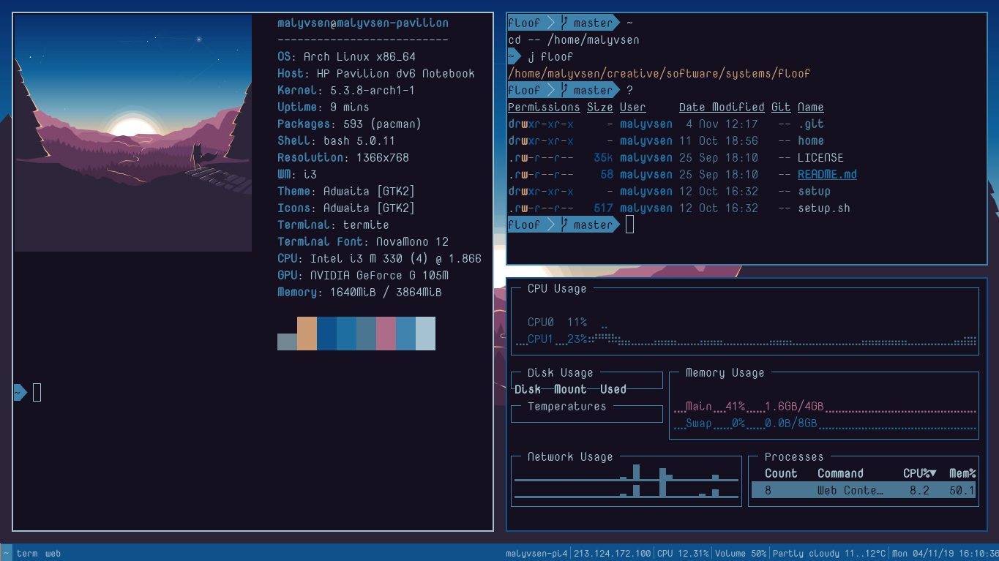
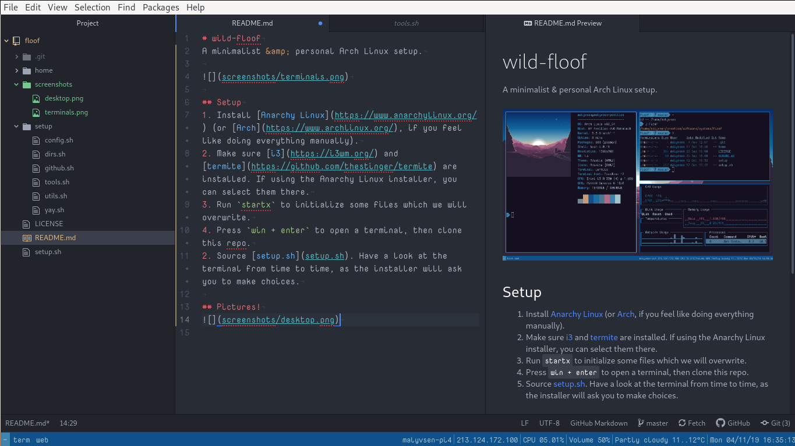

# wild-floof
A minimalist &amp; personal Arch Linux setup.

## Setup
1. Install [Anarchy Linux](https://www.anarchylinux.org/) (or [Arch](https://www.archlinux.org/), if you feel like doing everything manually).
2. Make sure [i3](https://i3wm.org/) and [termite](https://github.com/thestinger/termite) are installed. If using the Anarchy Linux installer, you can select them there.
3. Run `startx` to initialize some files which we will overwrite.
4. Press `win + enter` to open a terminal, then clone this repo.
2. Source [setup.sh](setup.sh). Have a look at the terminal from time to time, as the installer will ask you to make choices.

## Pictures!

